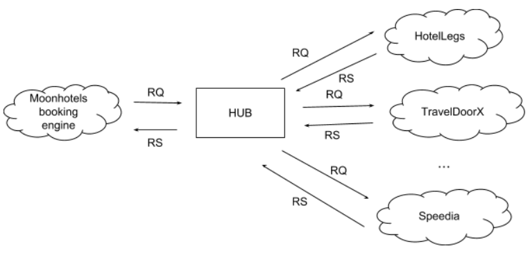

<p align="center"><a href="https://laravel.com" target="_blank"></a></p>

<p align="center">
<a href="https://travis-ci.org/laravel/framework"></a>
<a href="https://packagist.org/packages/laravel/framework"></a>
<a href="https://packagist.org/packages/laravel/framework"></a>
<a href="https://packagist.org/packages/laravel/framework"></a>
</p>

# Architecture overview


# HUB Search format
Request:
```json
{
    "hotelId": 1,
    "checkIn": "2018-10-20",
    "checkOut": "2018-10-25",
    "numberOfGuests": 3,
    "numberOfRooms": 2,
    "currency": "EUR"
}
```
Response:
```json
{
    "rooms": [
        {
            "roomId": 1,
            "rates": [
                {
                    "mealPlanId": 1,
                    "isCancellable": false,
                    "price": 123.48
                },
                {
                    "mealPlanId": 1,
                    "isCancellable": true,
                    "price": 150.00
                }
            ]
        },
        {
            "roomId": 2,
            "rates": [
                {
                    "mealPlanId": 1,
                    "isCancellable": false,
                    "price": 148.25
                },
                {
                    "mealPlanId": 2,
                    "isCancellable": false,
                    "price": 165.38
                }
            ]
        }
    ]
}
```

## About This Project

This project is a Laravel-based web application that integrates with multiple hotel providers to search for hotel rooms and rates. The application consolidates responses from different providers into a unified format.

## Installation

1. Clone the repository:
    ```sh
    git clone https://github.com/yourusername/yourproject.git
    cd yourproject
    ```

2. Install dependencies:
    ```sh
    composer install
    npm install
    ```

3. Copy the `.env.example` file to `.env` and configure your environment variables:
    ```sh
    cp .env.example .env
    ```

4. Generate an application key:
    ```sh
    php artisan key:generate
    ```

5. Run database migrations:
    ```sh
    php artisan migrate
    ```

## Usage

1. Start the local development server:
    ```sh
    php artisan serve
    ```

2. Access the application in your web browser at `http://localhost:8000`.

## Running Tests

### PHPUnit

To run the PHPUnit tests, use the following command:
```sh
php artisan test